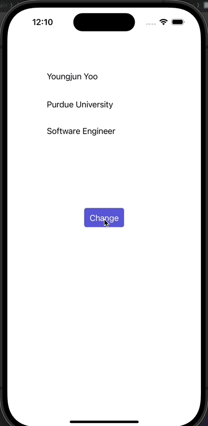

# Prework - *BgChanger*

Submitted by: **Youngjun Yoo**

**BgChanger** is an app that alters the background color to a randomly selected hue upon pressing a button.

Time spent: **2** hours spent in total

## Required Features

The following **required** functionality is completed:

- ✅ Users are see a screen with three labels and a button
- ✅ Tapping the button changes the screen color to a random color

## Ideas to Implement

Some ideas to **improve** the app are:

- Improve the UI by using different fonts/colors/background
- Feel free to play around with other elements, such as image views, textfields, etc.
- Implement a way to change the color of the text as well
 
## Video Walkthrough

Here's a walkthrough of implemented features:

## App Brainstorming (Step 4)

## Notes

Being new to Swift, I found great pleasure in constructing the app, thanks to the storyboard that offers an intuitive user interface for development. I plan to incorporate additional functionalities in the near future.

## License

    Copyright [2024] [Youngjun Yoo]

    Licensed under the Apache License, Version 2.0 (the "License");
    you may not use this file except in compliance with the License.
    You may obtain a copy of the License at

        http://www.apache.org/licenses/LICENSE-2.0

    Unless required by applicable law or agreed to in writing, software
    distributed under the License is distributed on an "AS IS" BASIS,
    WITHOUT WARRANTIES OR CONDITIONS OF ANY KIND, either express or implied.
    See the License for the specific language governing permissions and
    limitations under the License.
